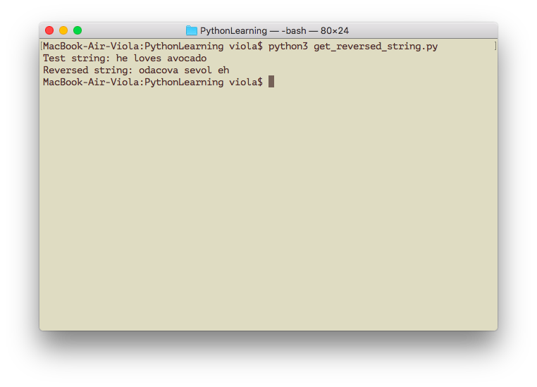
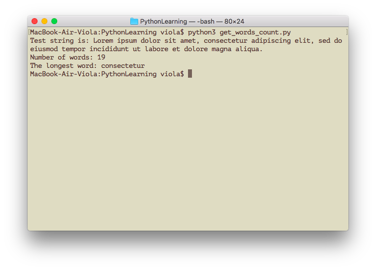

# PythonLearning
Project for mastering Python.

I'll add code samples in this project on my way of learning Python.

## Examples
### Work with strings

#### `get_reversed_string.py` — file contains a function that returns a reversed string

#### `get_words_count.py` — file contains several functions:
- `get_number_of_words` — returns number of words in passed string;
- `clear_repeating_whitespaces` — returns a new string without repeating whitespaces;
- `clear_punctuation` — returns a new string without punctuation characters;
- `remove_character_by_index` — returns a new string with removed character at the passed index;
- `split_string_into_words` — returns an array of words retreived from the passed string;
- `get_longest_word` — returns the longest word in passed string.

